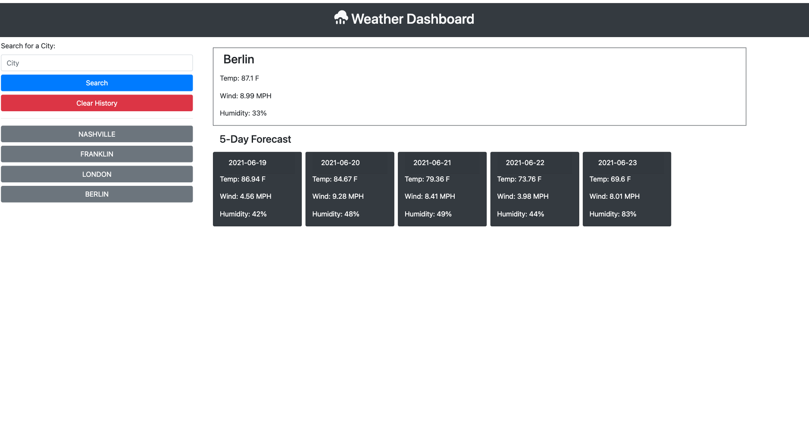

# weather-dashboard

## Purpose:
Provide weather conditions and forecasts for user-inputed cities.

## Requirements:
* Provide current conditions and 5-day forecast
* Save user queries and persist accross sessions via local storage
* Provide weather when history is recalled
* Utilize OpenWeather API

## Screenshot:

## Deployed Application:
https://bsottek.github.io/weather-dashboard/